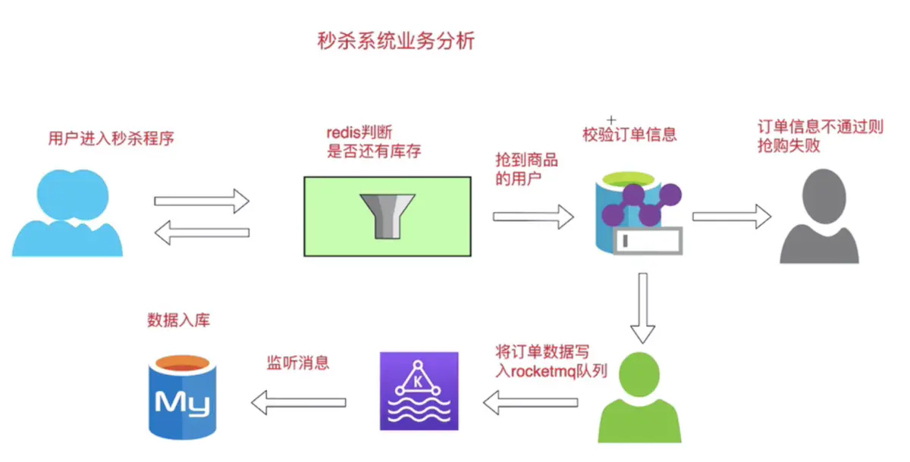
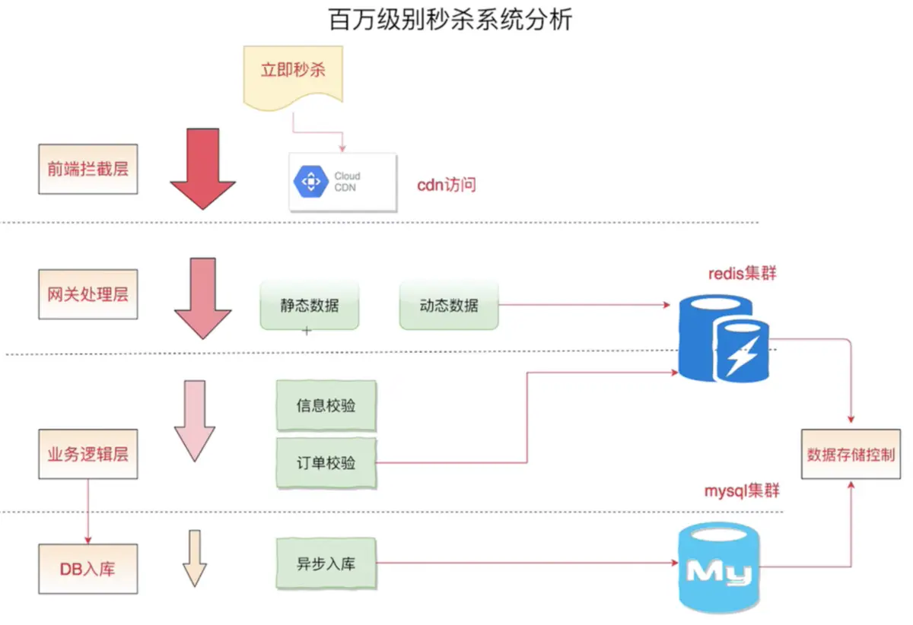
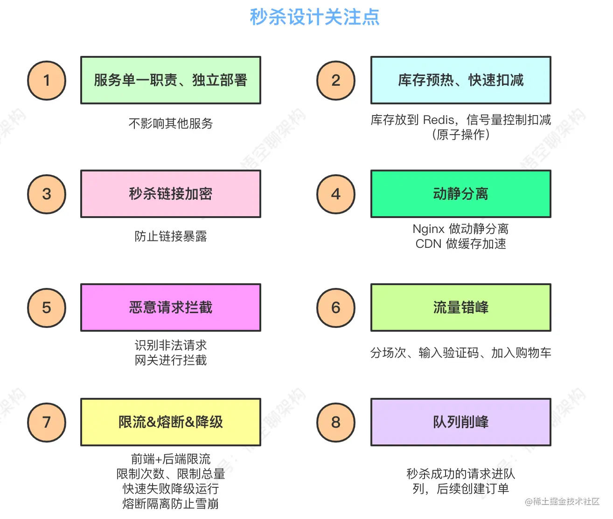

# 基于Redis实现秒杀

**活动多种商品参与秒杀，活动限购，商品限购（master）**
[](https://github.com/LmingXie/seconddemo/tree/master)

**单种商品秒杀，商品限购（one-sku）**
[](https://github.com/LmingXie/seconddemo/tree/one-sku)

### 1、需求分析

* 大量的刷新页面的操作
* 瞬间大量的抢购的操作
* 可能有秒杀器的恶性竞争
* 不能出现超卖

### 2、总体思路

* **CDN**
    * Nginx进行动静分离.
    * 静态资源推送到CDN.
* **安全保护**
    * [隐藏秒杀链接](https://www.cnblogs.com/myseries/p/11891132.html)
    * 限制User每秒请求.
    * 限流(压测出机器的性能拐点,配置好QPS限流).
* **热点分离**
    * 秒杀设计独立的域名和工程,不能影响其它的业务.
    * 秒杀设计弹性资源的分配.
* **缓存**
    * 在秒杀前,把秒杀的SKU和库存,预热到Redis中.
    * 通过Lua+Redis(原子性)实现秒杀.
* **异步削峰**
    * Redis扣库存成功后,调用(生产者)MQ创建订单,并,返回一个唯一ID给前端.
    * MQ(消费者)订阅信息,根据自身的能力,创建订单/扣库存…
    * 前端通过ID轮询,或者,等待websocket通知:秒杀成功,跳转到支付页面.

### 3、整体架构图




### 4、秒杀关注点



### 5、订单超时

#### 定时任务

这种实现方式在订单量较大的情况下是有问题的，而且时间也会有误差，最大时间差就是定时任务的执行间隔时间。

#### Redis过期事件

属于全局操作，全部key都将会被监听。

##### 1、修改redis.windows.conf配置文件中notify-keyspace-events的值

默认配置``notify-keyspace-events``的值为" ",修改为``notify-keyspace-events Ex`` 这样便开启了过期事件。

##### 2、创建配置类``RedisListenerConfig``（配置RedisMessageListenerContainer这个Bean）

```java

@Configuration
public class RedisListenerConfig {

    @Autowired
    private RedisTemplate redisTemplate;

    /**
     * 处理乱码
     * @return
     */
    @Bean
    public RedisTemplate redisTemplateInit() {
        // key序列化
        redisTemplate.setKeySerializer(new StringRedisSerializer());
        //val实例化
        redisTemplate.setValueSerializer(new GenericJackson2JsonRedisSerializer());

        return redisTemplate;
    }


    @Bean
    RedisMessageListenerContainer container(RedisConnectionFactory connectionFactory) {

        RedisMessageListenerContainer container = new RedisMessageListenerContainer();
        container.setConnectionFactory(connectionFactory);
        return container;
    }

}
```

##### 3、继承KeyExpirationEventMessageListener创建redis过期事件的监听类

```java

@Component
public class RedisKeyExpirationListener extends KeyExpirationEventMessageListener {
    public RedisKeyExpirationListener(RedisMessageListenerContainer container) {
        super(container);
    }

    /**
     * 针对redis数据失效事件，进行数据处理
     * @param message
     * @param pattern
     */
    @Override
    public void onMessage(Message message, byte[] pattern) {
        String key = message.toString();//生效的key
        if (key != null && key.startsWith("order")) {//从失效key中筛选代表订单失效的key
            //截取订单号，查询订单，如果是未支付状态则取消订单
            String orderNo = key.substring(5);
            System.out.println("订单号为：" + orderNo + "的订单超时未支付，取消订单");

        }
    }
}
```
